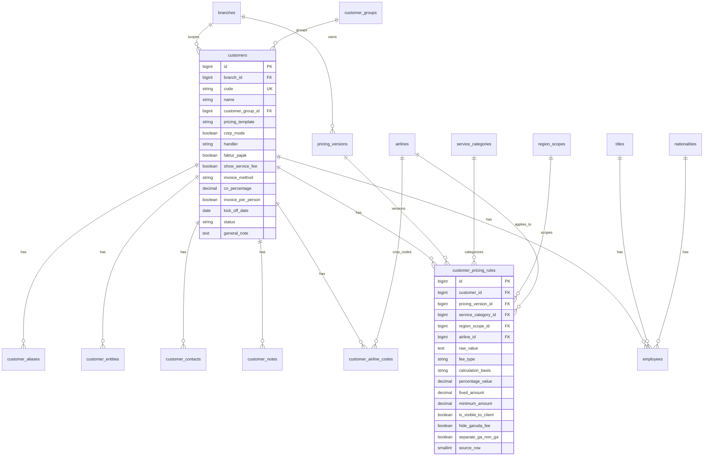

# Rancangan Database — Website Pengelolaan Data Customers

> **Stack:** Laravel 11 (Backend API) + Vue 3 (Frontend SPA)  
> **Sumber data awal:** `Employee Data - PT. Sol Melia Indonesia as of August 24.csv` & `SF CORP UPDATE MEI.csv`  
> **Versi dokumen:** 1.0 — Tahap Perancangan

---

## 1. Analisis Sumber Data

### 1.1 Employee Data (PT. Sol Melia Indonesia)

Data karyawan/traveler per perusahaan korporat, digunakan untuk keperluan ticketing.

| Kolom CSV | Tipe Data | Keterangan |
|-----------|-----------|------------|
| No. | Integer | Nomor urut (tidak perlu disimpan permanen) |
| Title | Enum | Mr., Mrs., Ms. |
| Name | String | Nama lengkap |
| Nationality | String | Kebangsaan (SPANISH, INDONESIA, dll.) |
| Passport No. | String | Nomor paspor |
| Passport Exp Date | Date | Tanggal kadaluarsa paspor |
| KTP No. | String | Nomor KTP (nullable, `-` = kosong) |
| Birthdate | Date | Tanggal lahir (nullable) |
| Mobile No. | String | Nomor HP |
| Email | String | Email kantor |
| Reservation/Ticket Name | String | Format nama di tiket (LASTNAME / FIRSTNAME) |

**Catatan:** File ini khusus untuk **1 perusahaan** (PT. Sol Melia Indonesia). Pola yang sama dapat diulang untuk perusahaan korporat lain.

---

### 1.2 SF CORP UPDATE MEI (Service Fee Matrix)

Matriks **service fee / markup** per customer korporat untuk berbagai layanan travel.

**Struktur header (3 baris):**

```
Baris 1: CUSTOMERS | AIRLINES (INTL + DOMESTIC) | ISSUE 24JAM | HOTEL | TRAIN/BUS/TRAVEL | RENT CAR | REISSUE FEE | MATERAI | TAKEOVER PAYMENT | INSURANCE | NOTE
Baris 2:            | INTERNATIONAL | DOMESTIC (sub-kategori)
Baris 3:            |               | GARUDA | OTHER AIRLINES | LCC | PERINTIS AIRLINE
```

**Kategori layanan:**

| Kode | Nama | Sub-kategori / Scope |
|------|------|---------------------|
| `AIRLINE_INTL` | Maskapai Internasional | — |
| `AIRLINE_DOM_GA` | Maskapai Domestik — Garuda | Garuda Indonesia |
| `AIRLINE_DOM_OTHER` | Maskapai Domestik — Other | Lion, SJ, Citilink |
| `AIRLINE_DOM_LCC` | Maskapai Domestik — LCC | Air Asia, Pelita Air, TransNusa, Scoot |
| `AIRLINE_DOM_PERINTIS` | Maskapai Domestik — Perintis | Trigana, Susi Air, Express Air |
| `ISSUE_24JAM` | Issue 24 Jam | — |
| `HOTEL` | Hotel | DOMESTIC / INTERNATIONAL |
| `TRAIN_BUS_TRAVEL` | Kereta / Bus / Travel | KAI & KCIC, Travel/Bus (bisa berbeda per scope) |
| `RENT_CAR` | Sewa Mobil | DOMESTIC / INTERNATIONAL |
| `REISSUE_FEE` | Biaya Reissue | DOMESTIC / INTERNATIONAL |
| `MATERAI` | Bea Materai | YES / NO / STAMP DUTY |
| `TAKEOVER_PAYMENT` | Takeover Payment | Persentase atau nominal |
| `INSURANCE` | Asuransi | Per person / nominal |
| `NOTE` | Catatan khusus | Free text |

**Pola data yang teridentifikasi:**

1. **Satu customer = 1–2 baris CSV** — baris kedua (nama kosong) berisi detail scope INTERNATIONAL untuk Hotel, Train, Rent Car, Reissue.
2. **Nilai pricing beragam:** persentase (`UP 3%`), nominal tetap (`UP 50,000 PER TIKET`), teks bebas (`ON THE TICKET`, `MARKUP`, `-`).
3. **Flag khusus:** `SERVICE FEE JANGAN DISHOW`, `GA DITONGOLIN`, `GA & NON GA DIPISAH`, `INVOICE DIBUAT PERNAMA`.
4. **Beberapa nama customer digabung** dengan `/` (contoh: `TOKOBAGUS (OLX) / ASTRA DIGITAL MOBIL / SERASI MITRA MOBIL`).
5. **Duplikat nama** — `PERUM LKBN ANTARA` muncul 2x dengan pricing berbeda → perlu versioning atau alias group.

---

## 2. Entity Relationship Diagram

```mermaid
erDiagram
    users ||--o{ activity_logs : creates
    users }o--|| roles : has

    customers ||--o{ employees : has
    customers ||--o{ customer_pricing_rules : has
    customers ||--o{ customer_notes : has
    customers ||--o{ customer_aliases : has
    customers }o--o| customer_groups : "may belong to"

    service_categories ||--o{ customer_pricing_rules : categorizes
    pricing_versions ||--o{ customer_pricing_rules : versions

    nationalities ||--o{ employees : has
    titles ||--o{ employees : has

    customers {
        bigint id PK
        string code UK
        string name
        string slug
        enum status
        text general_note
        timestamps
        soft_deletes
    }

    employees {
        bigint id PK
        bigint customer_id FK
        bigint title_id FK
        bigint nationality_id FK
        string full_name
        string passport_number
        date passport_expiry
        string ktp_number
        date birthdate
        string mobile
        string email
        string ticket_name_format
        enum status
        timestamps
        soft_deletes
    }

    service_categories {
        bigint id PK
        string code UK
        string name
        bigint parent_id FK
        int sort_order
        boolean requires_scope
    }

    customer_pricing_rules {
        bigint id PK
        bigint customer_id FK
        bigint service_category_id FK
        bigint pricing_version_id FK
        enum region_scope
        text raw_value
        enum fee_type
        enum calculation_basis
        decimal percentage_value
        decimal fixed_amount
        string currency
        boolean is_visible_to_client
        boolean hide_garuda_fee
        boolean separate_ga_non_ga
        text internal_note
        timestamps
    }

    pricing_versions {
        bigint id PK
        string name
        date effective_from
        date effective_to
        boolean is_active
        timestamps
    }
```

---

## 3. Definisi Tabel

### 3.1 Modul Autentikasi & Audit

#### `users`
Pengguna internal (staff travel agency).

| Kolom | Tipe | Keterangan |
|-------|------|------------|
| id | BIGINT PK | |
| name | VARCHAR(100) | |
| email | VARCHAR(150) UNIQUE | |
| password | VARCHAR(255) | |
| email_verified_at | TIMESTAMP NULL | |
| is_active | BOOLEAN DEFAULT true | |
| remember_token | VARCHAR(100) | |
| created_at, updated_at | TIMESTAMP | |

#### `roles` & `permissions` (via Spatie Laravel Permission)
| Role contoh | Akses |
|-------------|-------|
| super_admin | Full access |
| admin | CRUD customers, employees, pricing |
| operator | Read + update pricing, employees |
| viewer | Read only |

#### `activity_logs`
Audit trail perubahan data (via Spatie Activity Log).

| Kolom | Tipe | Keterangan |
|-------|------|------------|
| id | BIGINT PK | |
| log_name | VARCHAR | |
| description | TEXT | |
| subject_type, subject_id | MORPH | Model yang diubah |
| causer_type, causer_id | MORPH | User yang mengubah |
| properties | JSON | old/new values |
| created_at | TIMESTAMP | |

---

### 3.2 Modul Customer (Korporat)

#### `customers`
Entitas utama — perusahaan korporat klien.

| Kolom | Tipe | Keterangan |
|-------|------|------------|
| id | BIGINT PK | |
| code | VARCHAR(50) UNIQUE NULL | Kode internal, auto-generate |
| name | VARCHAR(255) | Nama perusahaan (dari kolom CUSTOMERS) |
| slug | VARCHAR(255) UNIQUE | URL-friendly name |
| customer_group_id | BIGINT FK NULL | Grup perusahaan terkait |
| status | ENUM('active','inactive') | |
| general_note | TEXT NULL | Catatan umum |
| invoice_per_person | BOOLEAN DEFAULT false | Flag "INVOICE DIBUAT PERNAMA" |
| created_at, updated_at | TIMESTAMP | |
| deleted_at | TIMESTAMP NULL | Soft delete |

**Index:** `name`, `status`, `customer_group_id`

#### `customer_groups`
Untuk customer yang pricing-nya digabung (contoh: TOKOBAGUS / ASTRA DIGITAL MOBIL).

| Kolom | Tipe | Keterangan |
|-------|------|------------|
| id | BIGINT PK | |
| name | VARCHAR(255) | Nama grup |
| description | TEXT NULL | |
| created_at, updated_at | TIMESTAMP | |

#### `customer_aliases`
Nama alternatif / cabang dari customer yang sama.

| Kolom | Tipe | Keterangan |
|-------|------|------------|
| id | BIGINT PK | |
| customer_id | BIGINT FK | |
| alias_name | VARCHAR(255) | |
| created_at, updated_at | TIMESTAMP | |

#### `customer_notes`
Catatan khusus per customer (dari kolom NOTE di CSV).

| Kolom | Tipe | Keterangan |
|-------|------|------------|
| id | BIGINT PK | |
| customer_id | BIGINT FK | |
| note | TEXT | |
| is_important | BOOLEAN DEFAULT false | |
| created_by | BIGINT FK → users | |
| created_at, updated_at | TIMESTAMP | |

---

### 3.3 Modul Employee (Traveler)

#### `titles` (Master Data)
| id | code | name |
|----|------|------|
| 1 | mr | Mr. |
| 2 | mrs | Mrs. |
| 3 | ms | Ms. |
| 4 | dr | Dr. |

#### `nationalities` (Master Data)
| id | code | name |
|----|------|------|
| 1 | ID | Indonesia |
| 2 | ES | Spanish |
| ... | ... | ... |

#### `employees`

| Kolom | Tipe | Keterangan |
|-------|------|------------|
| id | BIGINT PK | |
| customer_id | BIGINT FK → customers | Perusahaan induk |
| title_id | BIGINT FK NULL → titles | Mr./Mrs./Ms. |
| nationality_id | BIGINT FK NULL → nationalities | |
| full_name | VARCHAR(255) | |
| passport_number | VARCHAR(50) NULL | |
| passport_expiry | DATE NULL | |
| ktp_number | VARCHAR(20) NULL | 16 digit NIK |
| birthdate | DATE NULL | |
| mobile | VARCHAR(20) NULL | Format: +62... |
| email | VARCHAR(150) NULL | |
| ticket_name_format | VARCHAR(255) NULL | Format: `LASTNAME / FIRSTNAME` |
| status | ENUM('active','inactive') | |
| created_at, updated_at | TIMESTAMP | |
| deleted_at | TIMESTAMP NULL | |

**Index:** `customer_id`, `email`, `passport_number`, `full_name`

---

### 3.4 Modul Service Fee / Pricing

#### `service_categories` (Master — Hierarki Layanan)

| id | code | name | parent_id | requires_scope | sort_order |
|----|------|------|-----------|----------------|------------|
| 1 | AIRLINES | Maskapai | NULL | false | 1 |
| 2 | AIRLINE_INTL | Internasional | 1 | false | 1 |
| 3 | AIRLINE_DOM | Domestik | 1 | false | 2 |
| 4 | AIRLINE_DOM_GA | Garuda | 3 | false | 1 |
| 5 | AIRLINE_DOM_OTHER | Other Airlines | 3 | false | 2 |
| 6 | AIRLINE_DOM_LCC | LCC | 3 | false | 3 |
| 7 | AIRLINE_DOM_PERINTIS | Perintis | 3 | false | 4 |
| 8 | ISSUE_24JAM | Issue 24 Jam | NULL | false | 2 |
| 9 | HOTEL | Hotel | NULL | **true** | 3 |
| 10 | TRAIN_BUS_TRAVEL | Kereta/Bus/Travel | NULL | **true** | 4 |
| 11 | RENT_CAR | Sewa Mobil | NULL | **true** | 5 |
| 12 | REISSUE_FEE | Reissue Fee | NULL | **true** | 6 |
| 13 | MATERAI | Bea Materai | NULL | false | 7 |
| 14 | TAKEOVER_PAYMENT | Takeover Payment | NULL | false | 8 |
| 15 | INSURANCE | Asuransi | NULL | false | 9 |

#### `pricing_versions`
Versioning untuk update berkala (MEI, AGUSTUS, dll.).

| Kolom | Tipe | Keterangan |
|-------|------|------------|
| id | BIGINT PK | |
| name | VARCHAR(100) | Contoh: "SF CORP UPDATE MEI 2025" |
| effective_from | DATE | |
| effective_to | DATE NULL | NULL = masih aktif |
| is_active | BOOLEAN DEFAULT false | Hanya 1 versi aktif |
| imported_from | VARCHAR(255) NULL | Nama file CSV sumber |
| imported_at | TIMESTAMP NULL | |
| imported_by | BIGINT FK NULL → users | |
| created_at, updated_at | TIMESTAMP | |

#### `customer_pricing_rules`
Tabel inti — menyimpan semua rule pricing per customer per layanan.

| Kolom | Tipe | Keterangan |
|-------|------|------------|
| id | BIGINT PK | |
| customer_id | BIGINT FK | |
| service_category_id | BIGINT FK | |
| pricing_version_id | BIGINT FK | |
| region_scope | ENUM('domestic','international','all') NULL | Wajib jika `requires_scope = true` |
| raw_value | TEXT | Nilai asli dari CSV (preservasi data) |
| fee_type | ENUM('markup','service_fee','mixed','on_ticket','none') NULL | Hasil parsing |
| calculation_basis | ENUM('from_total','from_basic','from_nett','per_ticket','per_way','per_day','per_room_night','per_person','fixed','percentage') NULL | |
| percentage_value | DECIMAL(8,4) NULL | Contoh: 3.0000 (= 3%) |
| fixed_amount | DECIMAL(15,2) NULL | Contoh: 50000.00 |
| currency | CHAR(3) DEFAULT 'IDR' | |
| is_visible_to_client | BOOLEAN DEFAULT true | false jika "JANGAN DISHOW" |
| hide_garuda_fee | BOOLEAN DEFAULT false | "GA DITONGOLIN" |
| separate_ga_non_ga | BOOLEAN DEFAULT false | "GA & NON GA DIPISAH" |
| internal_note | TEXT NULL | Catatan internal |
| created_at, updated_at | TIMESTAMP | |

**Unique constraint:** `(customer_id, service_category_id, pricing_version_id, region_scope)`

**Index:** `customer_id`, `pricing_version_id`, `service_category_id`

---

## 4. Mapping Data CSV → Database

### 4.1 Employee CSV → `employees`

```
CSV Row → employees
─────────────────────────────────────────────────────
Title              → titles.code (lookup)
Name               → full_name
Nationality        → nationalities.name (lookup/create)
Passport No.       → passport_number
Passport Exp Date  → passport_expiry (parse "February 25, 2030")
KTP No.            → ktp_number (NULL if "-")
Birthdate          → birthdate (NULL if "-")
Mobile No.         → mobile
Email              → email
Reservation/Ticket → ticket_name_format
(implicit)         → customer_id = PT. Sol Melia Indonesia
```

### 4.2 SF CORP CSV → `customers` + `customer_pricing_rules`

```
CSV Column Index → Mapping
─────────────────────────────────────────────────────
Col 0 (CUSTOMERS)  → customers.name (+ customer_aliases jika ada "/")
Col 1              → service_category: AIRLINE_INTL
Col 2              → service_category: AIRLINE_DOM_GA
Col 3              → service_category: AIRLINE_DOM_OTHER
Col 4              → service_category: AIRLINE_DOM_LCC
Col 5              → service_category: AIRLINE_DOM_PERINTIS
Col 6              → service_category: ISSUE_24JAM
Col 7              → service_category: HOTEL (scope dari baris 2)
Col 8              → service_category: TRAIN_BUS_TRAVEL
Col 9              → service_category: RENT_CAR
Col 10             → service_category: REISSUE_FEE
Col 11             → service_category: MATERAI
Col 12             → service_category: TAKEOVER_PAYMENT
Col 13             → service_category: INSURANCE
Col 14             → customer_notes.note
```

**Logika import baris ganda:**
- Baris dengan nama customer → insert/update customer + rules (scope = NULL atau 'all')
- Baris tanpa nama (continued) → insert rules dengan `region_scope = 'international'` untuk kategori yang `requires_scope = true`

---

## 5. Arsitektur Aplikasi

### 5.1 Backend — Laravel 11

```
backend/
├── app/
│   ├── Models/
│   │   ├── Customer.php
│   │   ├── Employee.php
│   │   ├── ServiceCategory.php
│   │   ├── CustomerPricingRule.php
│   │   └── PricingVersion.php
│   ├── Http/
│   │   ├── Controllers/Api/
│   │   │   ├── AuthController.php
│   │   │   ├── CustomerController.php
│   │   │   ├── EmployeeController.php
│   │   │   ├── PricingController.php
│   │   │   └── ImportController.php
│   │   ├── Requests/          # Form validation
│   │   └── Resources/         # API transformers
│   ├── Services/
│   │   ├── CsvImport/
│   │   │   ├── EmployeeCsvImporter.php
│   │   │   └── ServiceFeeCsvImporter.php
│   │   └── PricingParser.php  # Parse raw_value → structured fields
│   └── Policies/              # Authorization
├── database/
│   ├── migrations/
│   └── seeders/
│       ├── ServiceCategorySeeder.php
│       ├── TitleSeeder.php
│       └── NationalitySeeder.php
└── routes/
    └── api.php
```

#### Plugin/Packages Laravel (Recommended)

| Package | Fungsi |
|---------|--------|
| `laravel/sanctum` | API token authentication (SPA) |
| `spatie/laravel-permission` | Role & permission management |
| `spatie/laravel-activitylog` | Audit log perubahan data |
| `maatwebsite/excel` | Import/export CSV & Excel |
| `spatie/laravel-query-builder` | Filtering, sorting, includes API |
| `spatie/laravel-data` | DTO / structured data objects (opsional) |
| `dedoc/scramble` | Auto-generate API documentation |

---

### 5.2 Frontend — Vue 3

```
frontend/
├── src/
│   ├── api/                   # Axios service modules
│   │   ├── customers.js
│   │   ├── employees.js
│   │   └── pricing.js
│   ├── stores/                # Pinia state management
│   │   ├── auth.js
│   │   └── customers.js
│   ├── router/
│   │   └── index.js
│   ├── views/
│   │   ├── DashboardView.vue
│   │   ├── customers/
│   │   │   ├── CustomerListView.vue
│   │   │   ├── CustomerDetailView.vue
│   │   │   └── CustomerFormView.vue
│   │   ├── employees/
│   │   │   ├── EmployeeListView.vue
│   │   │   └── EmployeeFormView.vue
│   │   ├── pricing/
│   │   │   ├── PricingMatrixView.vue
│   │   │   └── PricingVersionView.vue
│   │   └── import/
│   │       └── ImportView.vue
│   ├── components/
│   │   ├── layout/
│   │   ├── customers/
│   │   ├── employees/
│   │   └── pricing/
│   └── composables/           # Reusable logic
└── package.json
```

#### Plugin/Packages Vue (Recommended)

| Package | Fungsi |
|---------|--------|
| `vue@3` | Core framework (Composition API) |
| `vue-router@4` | Client-side routing |
| `pinia` | State management |
| `axios` | HTTP client |
| `element-plus` atau `vuetify` | UI component library |
| `@vueuse/core` | Utility composables |
| `vee-validate` + `yup` | Form validation |
| `dayjs` | Date formatting/parsing |
| `@tanstack/vue-table` | Data table dengan sorting/filtering |
| `xlsx` atau `papaparse` | Client-side CSV preview (opsional) |

---

## 6. API Endpoints (Draft)

### Auth
| Method | Endpoint | Deskripsi |
|--------|----------|-----------|
| POST | `/api/login` | Login |
| POST | `/api/logout` | Logout |
| GET | `/api/user` | Profile user |

### Customers
| Method | Endpoint | Deskripsi |
|--------|----------|-----------|
| GET | `/api/customers` | List + filter + pagination |
| POST | `/api/customers` | Create |
| GET | `/api/customers/{id}` | Detail + employees + pricing |
| PUT | `/api/customers/{id}` | Update |
| DELETE | `/api/customers/{id}` | Soft delete |

### Employees
| Method | Endpoint | Deskripsi |
|--------|----------|-----------|
| GET | `/api/customers/{id}/employees` | List employee per customer |
| POST | `/api/employees` | Create |
| PUT | `/api/employees/{id}` | Update |
| DELETE | `/api/employees/{id}` | Soft delete |
| GET | `/api/employees/expiring-passports` | Alert paspor akan expired |

### Pricing
| Method | Endpoint | Deskripsi |
|--------|----------|-----------|
| GET | `/api/pricing-versions` | List versi pricing |
| POST | `/api/pricing-versions` | Create versi baru |
| POST | `/api/pricing-versions/{id}/activate` | Set versi aktif |
| GET | `/api/customers/{id}/pricing` | Pricing matrix per customer |
| PUT | `/api/customers/{id}/pricing` | Bulk update pricing rules |
| GET | `/api/pricing/compare` | Compare 2 versi pricing |

### Import
| Method | Endpoint | Deskripsi |
|--------|----------|-----------|
| POST | `/api/import/employees` | Upload CSV employee |
| POST | `/api/import/service-fees` | Upload CSV SF CORP |
| GET | `/api/import/preview` | Preview sebelum commit |

---

## 7. Halaman Frontend (Wireframe Logic)

```
┌─────────────────────────────────────────────────────────┐
│  SIDEBAR                    │  MAIN CONTENT              │
│  ─────────                  │                            │
│  📊 Dashboard               │  ┌─ Stats Cards ─────────┐ │
│  🏢 Customers               │  │ Total Customers: 120  │ │
│  👤 Employees               │  │ Total Employees: 450  │ │
│  💰 Service Fee Matrix      │  │ Expiring Passport: 12 │ │
│  📥 Import Data             │  └───────────────────────┘ │
│  ⚙️ Settings                │                            │
│                             │  Recent Activity Log       │
└─────────────────────────────┴────────────────────────────┘

Customer Detail Page:
┌─ Tabs ──────────────────────────────────────────────────┐
│ [Info] [Employees] [Service Fee] [Notes] [History]      │
├─────────────────────────────────────────────────────────┤
│ Tab Service Fee:                                        │
│ ┌──────────────┬──────────┬──────────┬──────────┐     │
│ │ Service      │ Domestic │ Intl     │ Note     │     │
│ ├──────────────┼──────────┼──────────┼──────────┤     │
│ │ Garuda       │ UP 1%    │ —        │          │     │
│ │ Other Airline│ UP 1%    │ —        │          │     │
│ │ Hotel        │ 40,000   │ 75,000   │ /R/N     │     │
│ │ ...          │          │          │          │     │
│ └──────────────┴──────────┴──────────┴──────────┘     │
└─────────────────────────────────────────────────────────┘
```

---

## 8. Contoh Migration Laravel

```php
// database/migrations/2025_06_05_000001_create_customers_table.php
Schema::create('customers', function (Blueprint $table) {
    $table->id();
    $table->string('code', 50)->unique()->nullable();
    $table->string('name');
    $table->string('slug')->unique();
    $table->foreignId('customer_group_id')->nullable()->constrained()->nullOnDelete();
    $table->enum('status', ['active', 'inactive'])->default('active');
    $table->text('general_note')->nullable();
    $table->boolean('invoice_per_person')->default(false);
    $table->timestamps();
    $table->softDeletes();

    $table->index('name');
    $table->index('status');
});

// database/migrations/2025_06_05_000005_create_customer_pricing_rules_table.php
Schema::create('customer_pricing_rules', function (Blueprint $table) {
    $table->id();
    $table->foreignId('customer_id')->constrained()->cascadeOnDelete();
    $table->foreignId('service_category_id')->constrained();
    $table->foreignId('pricing_version_id')->constrained();
    $table->enum('region_scope', ['domestic', 'international', 'all'])->nullable();
    $table->text('raw_value');
    $table->enum('fee_type', ['markup', 'service_fee', 'mixed', 'on_ticket', 'none'])->nullable();
    $table->enum('calculation_basis', [
        'from_total', 'from_basic', 'from_nett',
        'per_ticket', 'per_way', 'per_day', 'per_room_night',
        'per_person', 'fixed', 'percentage'
    ])->nullable();
    $table->decimal('percentage_value', 8, 4)->nullable();
    $table->decimal('fixed_amount', 15, 2)->nullable();
    $table->char('currency', 3)->default('IDR');
    $table->boolean('is_visible_to_client')->default(true);
    $table->boolean('hide_garuda_fee')->default(false);
    $table->boolean('separate_ga_non_ga')->default(false);
    $table->text('internal_note')->nullable();
    $table->timestamps();

    $table->unique(
        ['customer_id', 'service_category_id', 'pricing_version_id', 'region_scope'],
        'pricing_rule_unique'
    );
});
```

---

## 9. Keputusan Desain Penting

| Keputusan | Alasan |
|-----------|--------|
| **`raw_value` tetap disimpan** | Data CSV sangat variatif; parsing otomatis bisa gagal. Raw value = source of truth. |
| **Pricing versioning** | SF CORP di-update berkala (MEI, dll.). Riwayat versi diperlukan untuk audit. |
| **Scope terpisah (domestic/intl)** | Banyak layanan punya harga berbeda per region (terlihat di baris kedua CSV). |
| **Soft delete** | Data customer/employee jangan dihapus permanen — compliance & audit. |
| **Customer groups & aliases** | Handle nama gabungan (`A / B / C`) dan duplikat nama. |
| **Flag boolean untuk rules khusus** | `hide_garuda_fee`, `is_visible_to_client` lebih queryable daripada parse teks. |
| **Master data terpisah** | `titles`, `nationalities`, `service_categories` → konsistensi & dropdown UI. |

---

## 10. Langkah Implementasi Berikutnya

1. **Setup project** — `laravel new backend` + `npm create vue@latest frontend`
2. **Buat migrations** — Semua tabel sesuai rancangan di atas
3. **Seed master data** — service_categories, titles, nationalities
4. **Buat CSV importer** — EmployeeCsvImporter & ServiceFeeCsvImporter
5. **Buat API CRUD** — Customers, Employees, Pricing
6. **Buat frontend** — List, form, pricing matrix view
7. **Import data awal** — Load 2 file CSV sebagai data seed
8. **Testing** — Feature test API + E2E basic flow

---

## 11. Estimasi Volume Data

| Entitas | Estimasi (dari CSV saat ini) |
|---------|------------------------------|
| Customers | ~100–120 perusahaan korporat |
| Employees | ~6 (Sol Melia), akan bertambah per customer |
| Pricing Rules | ~100 customers × ~15 services × ~1.5 scope ≈ **2,000–2,500 rows** |
| Pricing Versions | 1 aktif + riwayat per update bulanan |

Database MySQL/PostgreSQL dengan indexing di atas sudah lebih than sufficient untuk skala ini.

---

## 12. Format Master Universal (Semua Cabang)

> **Dokumen lengkap:** [master-format.md](./master-format.md)  
> **Implementasi:** migration `170001` + `170002`, seeder `ServiceCategorySeeder`, `RegionScopeSeeder`, `AirlineSeeder`  
> **Prinsip:** Satu struktur untuk semua cabang. Cabang hanya menentukan `branch_id`, bukan template kolom terpisah.

### Ringkasan

- **12 slot pricing** (`service_categories` dengan `is_pricing_slot = true`)
- **3 scope wilayah:** ALL, DOM, INTR
- **Maskapai:** per-airline individual (GA, JT, QG, …) — `airline_id` nullable jika tidak spesifik
- **Satu sel pricing** = `service_category` + `region_scope` + `airline` (opsional)

---

## 12.1 (Arsip) Analisis Dua Format CSV Cabang

> **Sumber:** `SF CORP UPDATE MEI.csv` & `Selling Corporate Ventura-1.csv`  
> **Konteks:** Analisis awal sebelum disatukan ke format master universal di atas.

### 12.1 Perbandingan Dua File

| Aspek | SF CORP UPDATE MEI | Selling Corporate Ventura-1 |
|-------|-------------------|----------------------------|
| **Fokus** | Matriks **Service Fee / Markup** per layanan | Matriks **Management Fee (Selling)** + operasional corporate |
| **Jumlah customer aktif** | ~90 nama (+ ~40 baris lanjutan scope intl) | ~25 grup utama (+ entitas anak kosong pricing) |
| **Dimensi maskapai** | Kategori: INTL + DOM (GA / OTHER / LCC / PERINTIS) | Per kode maskapai (GA, QR, EK, SQ, CX…) + tour/corporate code |
| **Dimensi wilayah** | Implisit di baris ke-2 (DOM/INTL untuk Hotel, Train, dll.) | Eksplisit: kolom Hotel DOM vs Hotel INTL terpisah |
| **Metadata customer** | Hampir hanya nama + catatan di kolom NOTE | PIC, Corp Mode, Handler, Faktur Pajak, CN %, metode Invoice |
| **Pola grup** | Nama digabung `/` (contoh: TOKOBAGUS / ASTRA…) | Grup multi-PT `A. PT … B. PT …` + baris anak tanpa pricing |
| **Refund** | Tidak ada | Kolom Refund Domestik & Internasional |
| **Versioning** | Nama file: UPDATE MEI | Kick-off date di remarks (contoh: 21 Juli 2025) |

### 12.2 Kesimpulan Desain

1. **Customer harus di-scope per cabang** (`branch_id`) — data SF CORP dan Ventura tidak boleh dicampur dalam satu baris pricing.
2. **Satu model pricing rule** cukup untuk kedua format, dengan dimensi:
   - `service_category_id` → jenis layanan
   - `region_scope_id` → `DOM` / `INTR` dari master **Scope Wilayah** (nullable = berlaku semua)
   - `airline_id` → dari master **Airlines** (nullable = tidak spesifik maskapai)
3. **Master Airlines** perlu diperluas: grup SF (GA, OTHER, LCC, PERINTIS) + maskapai individual Ventura (QR, EK, SQ, CX, …).
4. **Service categories** perlu kolom Ventura (DOC/VISA, OTHERS, REFUND, TICKET gabungan).
5. **Field operasional Ventura** disimpan di tabel customer & relasi, bukan di pricing rule.
6. **`raw_value` tetap wajib** — formula Ventura (`OTT + 3% + 1.1%`) dan SF (`UP 50,000 PER TIKET GA DITONGOLIN`) terlalu variatif untuk dipaksa full structured.

### 12.3 Relasi ke Master Data yang Sudah Ada

| Master Data | Pemakaian di Modul Customer |
|-------------|----------------------------|
| **Cabang** (`branches`) | Setiap customer & pricing version milik satu cabang |
| **Scope Wilayah** (`region_scopes`: INTR, DOM) | Pricing rule per layanan yang beda harga domestik/internasional |
| **Airlines** (`airlines` + pivot scope) | Kolom DOM GA/OTHER/LCC/PERINTIS (SF) & corporate code per maskapai (Ventura) |
| **Nationality** | Data employee / traveler |
| **Title** | Data employee / traveler |

### 12.4 Diagram ER (Revisi)



### 12.5 Definisi Tabel Baru / Revisi

#### `customers` (rebuild)

| Kolom | Tipe | Keterangan |
|-------|------|------------|
| id | BIGINT PK | |
| **branch_id** | BIGINT FK → branches | **Wajib.** SF CORP → cabang sumber (mis. JKT); Ventura → cabang Ventura |
| code | VARCHAR(50) UNIQUE NULL | Auto-generate per cabang |
| name | VARCHAR(255) | Nama utama corporate |
| slug | VARCHAR(255) | Unique per `branch_id` |
| customer_group_id | BIGINT FK NULL | Grup pricing gabungan |
| **pricing_template** | ENUM | `service_fee_matrix` (SF CORP) \| `management_fee` (Ventura) |
| **corp_mode** | BOOLEAN DEFAULT false | Ventura: kolom CORP MODE (✓) |
| **handler** | VARCHAR(50) NULL | Ventura: SONIA, ALDA, FITRI, dll. |
| **faktur_pajak** | BOOLEAN NULL | Ventura: FAKTUR PAJAK YES/NO |
| **show_service_fee** | BOOLEAN NULL | Ventura: SERVICE FEE YES/NO/Tergantung PIC |
| **invoice_method** | VARCHAR(30) NULL | `print`, `email`, `print_email`, `no` |
| **cn_percentage** | DECIMAL(6,2) NULL | Ventura: kolom CN (1%, 2.5%, 7%, …) |
| invoice_per_person | BOOLEAN DEFAULT false | SF: "INVOICE DIBUAT PERNAMA" |
| **kick_off_date** | DATE NULL | Ventura: dari remarks kick-off |
| status | ENUM | active / inactive |
| general_note | TEXT NULL | |
| timestamps, soft_deletes | | |

**Index:** `(branch_id, name)`, `(branch_id, status)`, `customer_group_id`

#### `customer_entities` (baru — Ventura & grup SF)

Entitas anak dalam satu grup corporate (contoh: GOLDEN ENERGY A–Z, EMI GROUP).

| Kolom | Tipe | Keterangan |
|-------|------|------------|
| id | BIGINT PK | |
| customer_id | BIGINT FK → customers | Parent group |
| entity_code | VARCHAR(20) NULL | A, B, C… |
| entity_name | VARCHAR(255) | Nama PT / entitas |
| inherits_pricing | BOOLEAN DEFAULT true | Baris kosong di CSV = pakai pricing parent |
| sort_order | SMALLINT | |
| timestamps | | |

#### `customer_contacts` (baru — Ventura PIC)

| Kolom | Tipe | Keterangan |
|-------|------|------------|
| id | BIGINT PK | |
| customer_id | BIGINT FK | |
| name | VARCHAR(150) | |
| phone | VARCHAR(30) NULL | |
| email | VARCHAR(150) NULL | |
| is_primary | BOOLEAN DEFAULT false | |
| timestamps | | |

#### `customer_airline_codes` (baru — Ventura)

Corporate / tour code per maskapai — tidak masuk pricing rule.

| Kolom | Tipe | Keterangan |
|-------|------|------------|
| id | BIGINT PK | |
| customer_id | BIGINT FK | |
| airline_id | BIGINT FK → airlines | GA, QR, EK, SQ, CX… |
| corporate_code | VARCHAR(50) NULL | BBNI, GOLD, BBRI… |
| tour_code | VARCHAR(50) NULL | PBR03, BRI25… |
| access_code | VARCHAR(100) NULL | |
| corporate_id | VARCHAR(50) NULL | |
| notes | TEXT NULL | |
| timestamps | | |

**Unique:** `(customer_id, airline_id)`

#### `service_categories` (perluas seeder)

Tambahan untuk Ventura + refund:

| code | name | requires_scope | parent |
|------|------|----------------|--------|
| TICKET_COMBINED | Tiket Dom & Intl | false | — |
| DOC_VISA | Dokumen / Visa | false | — |
| OTHERS | Lain-lain | false | — |
| REFUND_DOMESTIC | Refund Domestik | false | — |
| REFUND_INTERNATIONAL | Refund Internasional | false | — |

Kategori SF yang sudah ada (AIRLINES tree, HOTEL, TRAIN_BUS_TRAVEL, RENT_CAR, REISSUE_FEE, MATERAI, TAKEOVER_PAYMENT, INSURANCE) **tetap dipakai**.

#### `pricing_versions` (rebuild + cabang)

| Kolom | Tipe | Keterangan |
|-------|------|------------|
| id | BIGINT PK | |
| **branch_id** | BIGINT FK → branches | |
| name | VARCHAR(100) | "SF CORP UPDATE MEI 2025" / "Selling Corporate Ventura" |
| **template_type** | ENUM | `service_fee_matrix` \| `management_fee` |
| effective_from / effective_to | DATE | |
| is_active | BOOLEAN | Satu aktif per cabang + template |
| imported_from | VARCHAR(255) NULL | Nama file CSV |
| imported_at, imported_by | | |
| timestamps | | |

#### `customer_pricing_rules` (rebuild — inti gabungan)

| Kolom | Tipe | Keterangan |
|-------|------|------------|
| id | BIGINT PK | |
| customer_id | BIGINT FK | |
| pricing_version_id | BIGINT FK | |
| service_category_id | BIGINT FK | |
| **region_scope_id** | BIGINT FK NULL → region_scopes | NULL = all / tidak berlaku scope |
| **airline_id** | BIGINT FK NULL → airlines | SF: GA/OTHER/LCC/PERINTIS; Ventura: biasanya NULL di management fee |
| raw_value | TEXT | Nilai asli CSV |
| fee_type | VARCHAR(50) NULL | markup, service_fee, on_ticket, management_fee, none |
| calculation_basis | VARCHAR(60) NULL | from_total, from_basic, from_nett, per_ticket, per_way, per_day, per_room_night, per_person, fixed, percentage |
| percentage_value | DECIMAL(12,4) NULL | |
| fixed_amount | DECIMAL(15,2) NULL | |
| **minimum_amount** | DECIMAL(15,2) NULL | Ventura: "min. 50k", "min. 100k" |
| currency | CHAR(3) DEFAULT IDR | |
| is_visible_to_client | BOOLEAN DEFAULT true | SF: "JANGAN DISHOW" |
| hide_garuda_fee | BOOLEAN DEFAULT false | SF: "GA DITONGOLIN" |
| separate_ga_non_ga | BOOLEAN DEFAULT false | SF: "GA & NON GA DIPISAH" |
| **source_row** | SMALLINT DEFAULT 1 | Baris 1 atau 2 di CSV (scope intl lanjutan) |
| internal_note | TEXT NULL | |
| timestamps | | |

**Unique:** `(customer_id, pricing_version_id, service_category_id, region_scope_id, airline_id, source_row)`

> Ganti `region_scope` string enum lama dengan FK ke master `region_scopes` agar konsisten dengan menu Scope Wilayah.

#### `employees` (rebuild — tidak berubah konsep)

Tetap FK ke `customers`, `titles`, `nationalities` — untuk file employee per corporate (contoh: Sol Melia).

### 12.6 Mapping Kolom CSV → Database

#### SF CORP UPDATE MEI → `service_fee_matrix`

| Kolom CSV | service_category | region_scope | airline |
|-----------|------------------|--------------|---------|
| Col 1 (INTL) | AIRLINE_INTL | INTR | NULL |
| Col 2 (GARUDA) | AIRLINE_DOM | DOM | GA |
| Col 3 (OTHER) | AIRLINE_DOM | DOM | OTHER |
| Col 4 (LCC) | AIRLINE_DOM | DOM | LCC |
| Col 5 (PERINTIS) | AIRLINE_DOM | DOM | PERINTIS |
| Col 6 | ISSUE_24JAM | NULL | NULL |
| Col 7 | HOTEL | DOM (baris 1) / INTR (baris 2) | NULL |
| Col 8 | TRAIN_BUS_TRAVEL | DOM / INTR | NULL |
| Col 9 | RENT_CAR | DOM / INTR | NULL |
| Col 10 | REISSUE_FEE | DOM / INTR | NULL |
| Col 11 | MATERAI | NULL | NULL |
| Col 12 | TAKEOVER_PAYMENT | NULL | NULL |
| Col 13 | INSURANCE | NULL | NULL |
| Col 14 | → `customer_notes` | | |

**Baris lanjutan (nama kosong):** `source_row = 2`, `region_scope_id = INTR` untuk kategori `requires_scope = true`.

**Flags dari teks** → boolean di rule: `hide_garuda_fee`, `is_visible_to_client`, `separate_ga_non_ga`, `invoice_per_person` di customer.

#### Selling Corporate Ventura → `management_fee`

| Kolom CSV | Target |
|-----------|--------|
| CORPORATE | `customers.name` + `customer_entities` jika multi-PT |
| CORP MODE | `customers.corp_mode` |
| PIC NAME | `customer_contacts` |
| TICKET DOM & INTL | `customer_pricing_rules` → TICKET_COMBINED |
| HOTEL DOM | HOTEL + region_scope DOM |
| HOTEL INTL | HOTEL + region_scope INTR |
| DOC / VISA | DOC_VISA |
| CAR RENTAL | RENT_CAR (scope dari isi teks) |
| KERETA | TRAIN_BUS_TRAVEL |
| OTHERS | OTHERS |
| Refund Domestik | REFUND_DOMESTIC |
| Refund Internasional | REFUND_INTERNATIONAL |
| REMARKS | `customer_notes` |
| FAKTUR PAJAK | `customers.faktur_pajak` |
| SERVICE FEE | `customers.show_service_fee` |
| INVOICE | `customers.invoice_method` |
| CN | `customers.cn_percentage` |
| HANDLER | `customers.handler` |
| GA, QR, EK, SQ, CX… | `customer_airline_codes` |

### 12.7 Master Data — Penyesuaian Seeder

| Master | Tindakan |
|--------|----------|
| **branches** | Tambah cabang Ventura jika belum ada (mis. `VENTURA` / tim selling) |
| **region_scopes** | Sudah cukup: INTR, DOM |
| **airlines** | Tambah maskapai individual Ventura: QR, EK, SQ, CX, BMC, dll. (scope INTR/DOM sesuai kebutuhan) |
| **service_categories** | Tambah 5 kode Ventura (lihat 12.5) |
| **titles, nationalities** | Tidak perlu ubah |

### 12.8 Estimasi Volume (kedua cabang)

| Entitas | SF CORP | Ventura | Total perkiraan |
|---------|---------|---------|-----------------|
| Customers | ~90 | ~25 grup | ~115 (+ entitas anak ~50) |
| Pricing rules | ~1.800 | ~400 | ~2.200 |
| Airline codes | 0 | ~80 | ~80 |
| Contacts | 0 | ~60 | ~60 |
