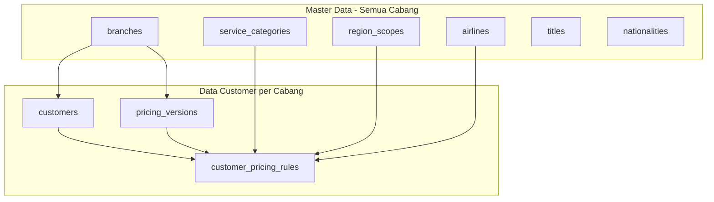

# Format Master Universal — Semua Cabang

Dokumen ini mendefinisikan **format master tunggal** yang dipakai seluruh cabang (Jakarta, Surabaya, Ventura, dll.) untuk data customer korporat dan service fee.

> Cabang hanya menentukan **siapa pemilik data** (`branch_id`), bukan struktur kolom yang berbeda.

---

## 1. Prinsip

1. **Satu struktur customer** — field profil lengkap (PIC, corp mode, invoice, CN, dll.) tersedia di semua cabang; yang tidak dipakai dibiarkan kosong.
2. **Satu matriks pricing** — setiap nilai fee disimpan sebagai **rule** dengan 3 dimensi master:
   - `service_category_id` → jenis layanan
   - `region_scope_id` → wilayah (ALL / DOM / INTR)
   - `airline_id` → maskapai atau grup maskapai (opsional)
3. **`raw_value` wajib** — teks asli formula/nilai tetap disimpan untuk audit & import CSV.
4. **Master data bersama** — Cabang, Scope Wilayah, Airlines, Kategori Layanan, Title, Nationality.

---

## 2. Master Data (Referensi)

### 2.1 Scope Wilayah (`region_scopes`)

| code | name          | Pemakaian                                      |
| ---- | ------------- | ---------------------------------------------- |
| ALL  | Semua Wilayah | Layanan tanpa beda dom/intl, tiket gabungan    |
| DOM  | Domestic      | Hotel domestik, tiket domestik, dll.           |
| INTR | International | Hotel internasional, tiket internasional, dll. |

### 2.2 Maskapai (`airlines`)

Setiap maskapai adalah **record individual** (contoh: GA Garuda, JT Lion Air, QG Citilink, QZ Air Asia) dengan scope wilayah INTR/DOM — dikelola lewat menu Master Data → Airlines, **bukan** lewat seeder grup.

| code              | contoh                 |
| ----------------- | ---------------------- |
| GA                | Garuda Indonesia       |
| JT                | Lion Air               |
| QG                | Citilink               |
| QZ                | Air Asia               |
| QR, EK, SQ, CX, … | Maskapai internasional |

Untuk pricing rule yang tidak spesifik maskapai, `airline_id` boleh **NULL**.

### 2.3 Kategori Layanan (`service_categories`)

Hanya baris dengan `is_pricing_slot = true` yang bisa diisi pricing.

| group_code    | code             | name                  | requires_scope | requires_airline |
| ------------- | ---------------- | --------------------- | -------------- | ---------------- |
| TICKETING     | AIRLINE          | Tiket Pesawat         | ✓              | ✓                |
| TICKETING     | ISSUE_24JAM      | Issue 24 Jam          |                |                  |
| TICKETING     | REISSUE_FEE      | Biaya Reissue         | ✓              |                  |
| TICKETING     | REFUND           | Refund                | ✓              |                  |
| ACCOMMODATION | HOTEL            | Hotel                 | ✓              |                  |
| GROUND        | TRAIN_BUS_TRAVEL | Kereta / Bus / Travel | ✓              |                  |
| GROUND        | RENT_CAR         | Sewa Mobil            | ✓              |                  |
| ADMIN         | DOC_VISA         | Dokumen / Visa        |                |                  |
| ADMIN         | MATERAI          | Bea Materai           |                |                  |
| ADMIN         | TAKEOVER_PAYMENT | Takeover Payment      |                |                  |
| OTHER         | INSURANCE        | Asuransi              |                |                  |
| OTHER         | OTHERS           | Lain-lain             |                |                  |

---

## 3. Satu Sel Pricing (Pricing Cell)

```
customer_pricing_rules =
  customer_id
+ pricing_version_id
+ service_category_id   ← HOTEL, AIRLINE, ...
+ region_scope_id     ← ALL | DOM | INTR
+ airline_id            ← GA | JT | QG | ... (nullable jika tidak spesifik maskapai)
+ source_row            ← 1 = baris utama CSV, 2 = baris lanjutan intl
+ raw_value             ← teks asli
```

**Contoh mapping SF CORP (Jakarta):**

| CSV                              | service_category | region_scope | airline                     |
| -------------------------------- | ---------------- | ------------ | --------------------------- |
| Kolom INTL                       | AIRLINE          | INTR         | NULL                        |
| Kolom GARUDA                     | AIRLINE          | DOM          | GA                          |
| Kolom OTHER (Lion, SJ, Citilink) | AIRLINE          | DOM          | JT / SJ / QG (per maskapai) |
| Hotel baris 1                    | HOTEL            | DOM          | —                           |
| Hotel baris 2                    | HOTEL            | INTR         | —                           |

**Contoh mapping Ventura:**

| CSV               | service_category           | region_scope | airline |
| ----------------- | -------------------------- | ------------ | ------- |
| TICKET DOM & INTL | AIRLINE                    | ALL          | NULL    |
| HOTEL DOM         | HOTEL                      | DOM          | —       |
| HOTEL INTL        | HOTEL                      | INTR         | —       |
| Refund Domestik   | REFUND                     | DOM          | —       |
| Corporate code GA | → `customer_airline_codes` |              | GA      |

---

## 4. Profil Customer (Semua Cabang)

| Field              | Keterangan                       |
| ------------------ | -------------------------------- |
| branch_id          | Cabang pemilik data              |
| name               | Nama corporate utama             |
| corp_mode          | Mode corporate (✓)               |
| handler            | Staff penanganan                 |
| faktur_pajak       | Apakah perlu faktur pajak        |
| show_service_fee   | Tampilkan SF di invoice          |
| invoice_method     | print / email / print_email / no |
| cn_percentage      | Persentase CN                    |
| invoice_per_person | Invoice per nama                 |
| kick_off_date      | Tanggal kick-off kontrak         |

**Relasi pendukung (opsional per customer):**

- `customer_contacts` — PIC
- `customer_entities` — sub-PT dalam grup
- `customer_aliases` — nama alternatif
- `customer_airline_codes` — kode corporate per maskapai
- `customer_notes` — catatan operasional
- `employees` — traveler (Title + Nationality dari master)

---

## 5. Versi Pricing

`pricing_versions` per cabang — satu versi aktif per cabang pada satu waktu.

Import CSV cabang manapun menghasilkan struktur rule yang **sama**; hanya mapping kolom CSV ke dimensi master yang berbeda per sumber file.

---

## 5.1 Format Excel Import

Import dibagi menjadi **dua file terpisah** (menu sidebar → **Import**):

### A. Data Corporate (`import-corporate-template.xlsx`)

Satu baris = satu corporate. Kolom grup:

| Grup | Kolom |
| ---- | ----- |
| Identitas | Cabang, Nama Corporate |
| Profil Operasional | Corp Mode, Faktur Pajak, Service Fee, Invoice, CN % |
| Materai | Materai (disimpan ke versi pricing aktif) |
| Periode Kontrak | Teks bebas, contoh: `Kontrak seumur hidup atau 02-09-2020 (perpanjang otomatis...)` |
| Catatan | Catatan |

> Alias dan PIC dihilangkan dari template (PIC diinput terpisah).

### B. Data Service (`import-service-template.xlsx`)

Satu baris = satu corporate. Kolom grup:

| Grup | Kolom |
| ---- | ----- |
| Identitas | Cabang, Nama Corporate |
| Maskapai | Dinamis dari master Airlines (International / Domestic) |
| Layanan | Issue 24 Jam, Hotel, Kereta, Rent Car, Reissue, Refund, Doc/Visa, Takeover, Asuransi, Others, Ticket (Gabungan) |

> Materai **tidak** ada di template service — import lewat Data Corporate. Import service memerlukan **Nama Versi Pricing**.

---

## 6. Diagram


